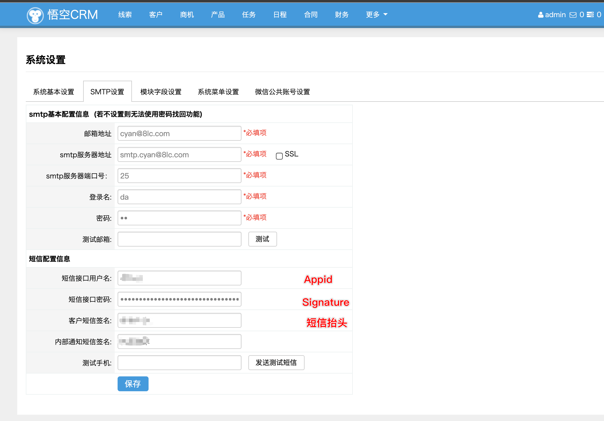

## OVERVIEW

### WukongCRM Plug-Ins Overview

------
	WukongCRM 短信插件
How to use

	1.将App/Lib/Action/SettingAction.class.php 中的代码替换追加到线上同名文件
	2.将App/Common/common.php,中的1093行的SendSMS代码段替换到线上同名文件
	3.寻到如图地址，填写用户名与密码

