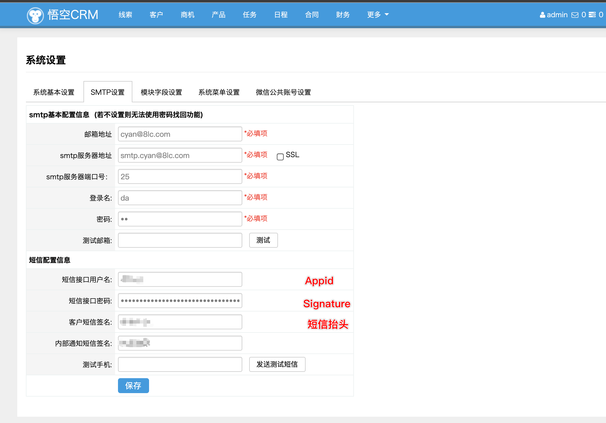

## OVERVIEW

### WukongCRM Plug-Ins Overview
>悟空CRM,开源免费CRM,智能化移动在线CRM系统.整合HR人力资源系统+进销存+财务管理,构建新一代CRM客户关系管理系统,助力企业业绩增长.

------
悟空CRM  [官网地址](https://www.5kcrm.com/)

How to use

	1.将App/Lib/Action/SettingAction.class.php 中的代码替换追加到线上同名文件
	2.将App/Common/common.php,中的1093行的SendSMS代码段替换到线上同名文件
	3.寻到如图地址，填写用户名与密码

[Github项目地址](https://github.com/submail-developers/wukongcrm_sms/)&nbsp;&nbsp;&nbsp;[点击下载](https://github.com/submail-developers/wukongcrm_sms/archive/master.zip)

